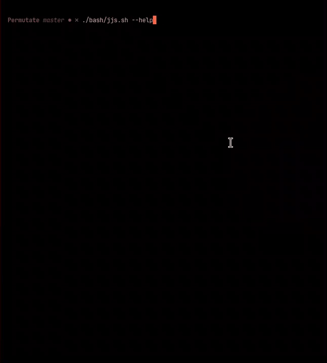

# Permutate

Permutate is a university project that compares several permutation algorithms by measuring the number of swaps each algorithm performs. The goal is to generate CSV output for algorithm analysis and to illustrate algorithm behavior using Java and JavaScript implementations.

## Project Overview

This repository includes:
- Java implementations of permutation algorithms.
- JavaScript utilities for testing and running permutation logic.
- CSV generation for swap-count comparisons instead of execution time.
- Documentation files in the `doc/` directory.




## How to Compile

Use the provided bash script:

```bat
bash\build.sh
```

## How to Run

For JavaScript, use the shell script:

```sh
./bash/jjs.sh
```

The script also supports arguments, for example:

```sh
./bash/jjs.sh --help
```

```sh
./bash/jjs.sh abc -v -p -m naive
```
## Output

The project generates a list of all permutation of a given string

## Documentation

Documentation is available in the `doc/` folder.

## Team

- Adrian Prendas 604140420
- Joseph Artavia 116330698
- Genesis Gonzales 116470598
- Flavio Mejia 801030130

